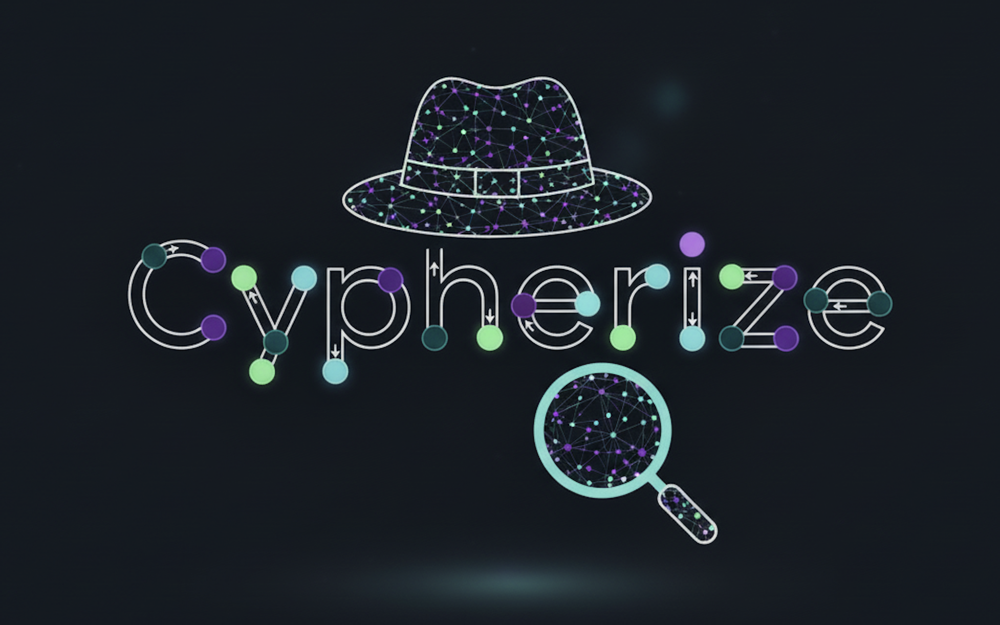

<div align="center">

  



  
  _Graph exploration using natural language and direct manipulation._

</div>

## 📖 About

**Cypherize** is an open-source application designed to lower the barrier to entry for graph-oriented databases. It allows users to import unstructured data (Text, PDF, JSON) and automatically transform it into a knowledge graph stored in **KuzuDB**.

Cypherize’s core innovation lies in its **hybrid interface**: it combines the power of **LLMs** (to translate natural language into Cypher queries) with the precision of **direct manipulation**. Cypherize enables users to explore a graph visually while querying it conversationally. Nodes can be dragged into the chat to semantically anchor queries.

Demo: https://drive.google.com/file/d/1_a_wS49fJXtjlfpGC_4pq3gxa8h2eqYV/view?usp=sharing


## 🚀 Features

- **✅ Data Ingestion:** Easily import and transform unstructured data (Text, CSV, JSON) into a structured KuzuDB graph.
- **✅ Natural Language Querying:** Interact with your database conversationally; no need to master query languages.
- **✅ Direct Manipulation:** Drag and drop nodes from the visual graph into the chat to provide precise context to the AI.
- **✅ Flexible AI Backends:** Switch seamlessly between local privacy-focused models (LM Studio) and powerful cloud providers (Mistral/Codestral).
- **✅ Interactive Visualization:** Navigate complex networks with a dynamic, visual interface.
- **✅ Expert Mode:** Execute raw Cypher queries directly for granular control over your data.
- **And much more...**


## 🛠 Technologies Used

| Domain       | Technology                       | Description                                                                 |
| ------------ | -------------------------------- | --------------------------------------------------------------------------- |
| **App**      | [Next.js](https://nextjs.org)    | React framework for a modern and reactive UI.                               |
| **Database** | [Kuzu](https://kuzudb.com)       | Extremely fast, embeddable graph database.                                  |
| **AI**       | [LM Studio](https://lmstudio.ai/) / [Mistral](https://mistral.ai/) | Supports local inference (LM Studio) or cloud API providers like Mistral. |

> **💡 AI Recommendation:**
> While Cypherize supports various providers, we recommend using the Devstral 24B model via Mistral or locally cause we have extensively tested this model.


## 💻 Installation & Getting Started

### Prerequisites

1.  **Node.js** (v18 or higher).
2.  **AI Backend Setup** (Choose one):
    *   **Option A: Local (Recommended for Privacy)**
        *   Download and install [LM Studio](https://lmstudio.ai/).
        *   Search for and download the **Codestral 22B** model (highly recommended for this task).
        *   Start the Local Server within LM Studio (default port is `1234`).
    *   **Option B: Cloud (Recommended for Performance)**
        *   Use the [Mistral AI API](https://console.mistral.ai/).
        *   *Note: You can easily generate a free API key on their platform to test the application.*

### 1. Clone the project

```bash
git clone https://github.com/GabrielBeaudoinUdem/Cypherize.git
cd Cypherize
```

### 2. Install dependencies

```bash
npm install
```
### 3. Start the development server

```bash
npm run dev
```

The application will be accessible at [http://localhost:3000](http://localhost:3000).
